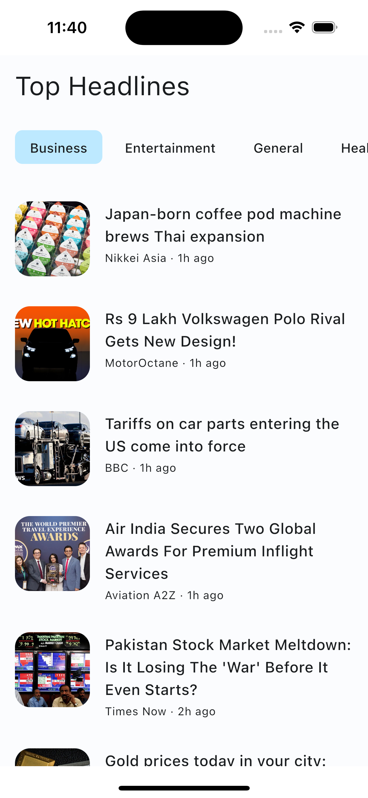
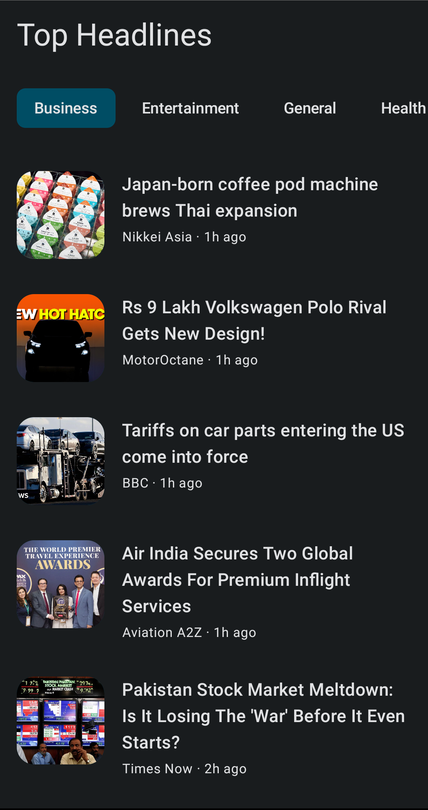
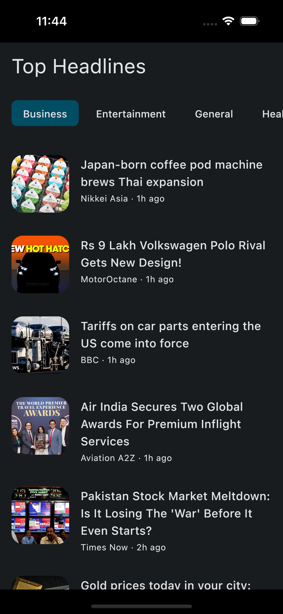

# GNews - A Simple News App

GNews is a Kotlin Multiplatform project designed to deliver a seamless news browsing experience across Android and iOS platforms. It leverages modern libraries and frameworks to ensure a robust and efficient application.

## Features

- [**Compose Multiplatform**](https://www.jetbrains.com/compose-multiplatform/): Unified UI development for Android and iOS.
- [**Ktor**](https://ktor.io/docs/client-create-multiplatform-application.html): Handles remote API calls for fetching news data.
- [**Kotlinx Serialization**](https://kotlinlang.org/docs/serialization.html): Simplifies JSON serialization and deserialization.
- [**Coroutines**](https://github.com/Kotlin/kotlinx.coroutines): Enables asynchronous operations for smooth performance.
- [**Koin**](https://insert-koin.io/docs/reference/koin-mp/kmp/): Dependency injection framework for better modularity and testability.
- [**Kamel**](https://github.com/Kamel-Media/Kamel): Efficient image loading and caching.

## Project Structure

### `/composeApp`
This module contains shared code for the Compose Multiplatform UI. It includes:

- `commonMain`: Houses code common to all platforms.
- Platform-specific folders (e.g., `iosMain`, `androidMain`): For platform-specific implementations, such as integrating native APIs.

### `/iosApp`
This module contains the iOS-specific entry point. It is also where you can add SwiftUI code if needed.

## Screenshots

Here are some snapshots of the app:

|               Android               |                iOS               |
|-------------------------------------|----------------------------------|
|    |     |
|      |       |

## Getting Started

To begin using the application, follow these steps:

1. **Obtain an API Key**:  
  The app retrieves news data from [gnews.io](https://gnews.io/). To access this service, you need to acquire an API key. Sign up or log in to the [GNews Dashboard](https://gnews.io/dashboard) to generate your API key. Note: The API key is free to obtain.

2. **Configure the API Key**:  
  Once you have your API key, replace the placeholder value of `API_KEY_VALUE` in the file [`modules.kt`](./composeApp/src/commonMain/kotlin/org/psquare/gnews/di/modules.kt) with your newly acquired API key.

By completing these steps, the application will be ready to fetch and display news content.

## Learn More

To get started with Kotlin Multiplatform, visit the [official documentation](https://www.jetbrains.com/help/kotlin-multiplatform-dev/get-started.html).